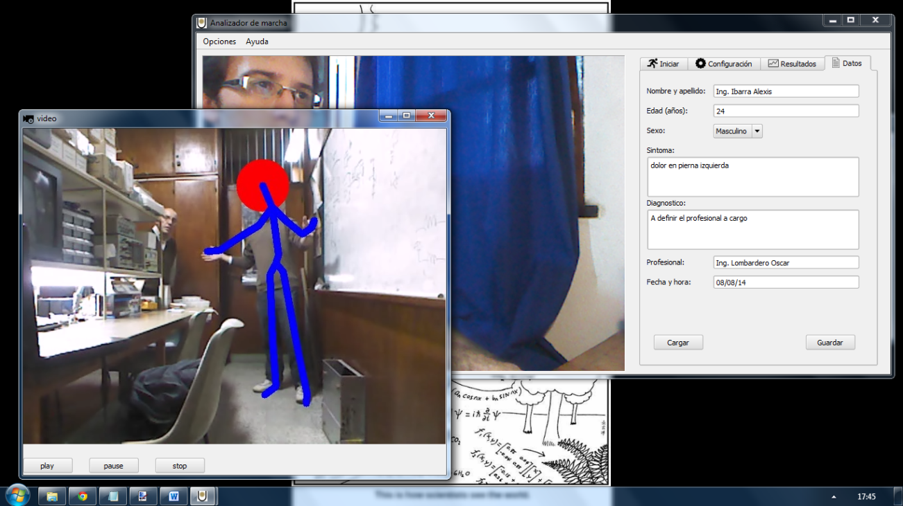
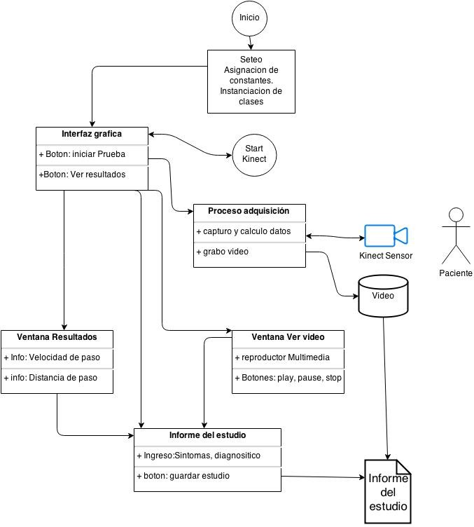
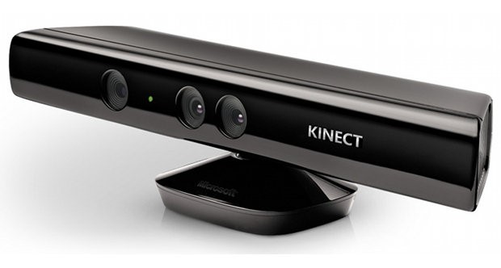
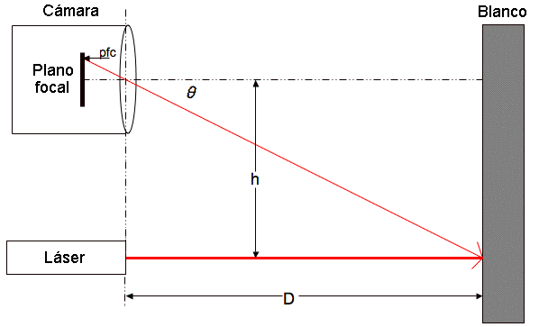
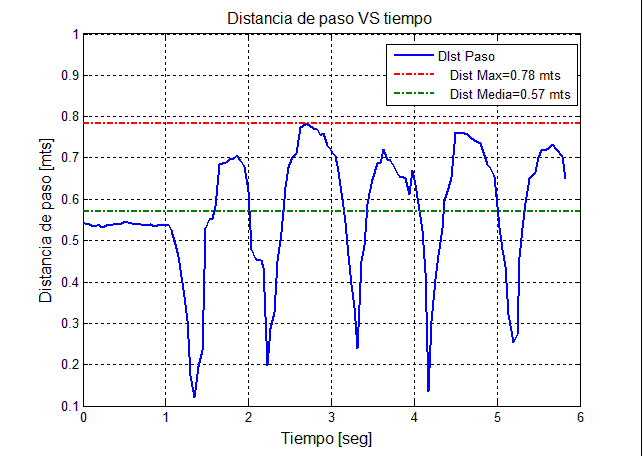
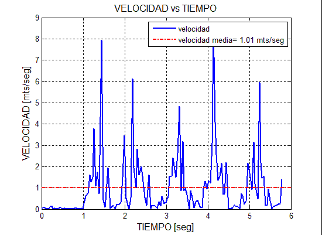

# Laboratorio de marchas (Walking_Posture_Analysis)

**Resumen (abstract):**
En los últimos años se han conseguido extraordinarios avances en los sistemas de software de vision computarizada e inteligencia artificial principalemente para uso recreativo (videojuegos). Sin embargo, la alta eficiencia y simplicidad conseguida con estas herramientas posibilito su introducción a la industria medicinal. En este campo resulta de mucha importancia la vison computariza para el análisis de marcha humana sin marcas. Historicamente el análisis de marcha humana se realizaba con marchas o “referencias” en las distitnas articulaciones del paciente, contribuyendo a la “incomodidad y falta de naturalidad” en el paciente al momento de ralizar el estudio.
Con las nuevas tecnologías de vision esteroscopica (Kinect, ref)  se hizo posible realizar estas mediciones sin marcas, pero agregando un nivel de error y alaeatoriedad todavía no estududiados en detalle, que necesitan de una comparación con datos verídicos para determinar su validez y presicion.
Conforme a lo anterior, en el presente informe se describe el desarrollo  de un software inédito en esta universidad, dedicado al análisis de la marcha humana,con las características de ser libre de licencias externas (GPL) , portátil (tanto en software como la instalación de medida),y completamente funcional (estable).
QUE se hizo ? Un sistema que permite analizar la marcha humana, con el método sin marcas, y sin necesitar de un laboratorio destinado a tal efecto (portatil).
Este sistema se contrasto con mediciones experimentales de un patrón de caminata conocido (tablon), por  lo tanto se pudo determinar el error máximo presente en la medicion del sistema de software desarrollado.

---

# Arquitectura de software

---

## Marco Teorico

### PRINCIPIO FISICO DE LA MEDICION

El software desarrollado se basa en el principio de vision estereoscópica. Este principio, de bases algebraicas, permite determinar la profundidad de un objeto en el espacio, como asi también su volumen y posición relativa despecto del entorno. Para ello se utilizo un sensor óptico multiple denominado Kinect V.1 (Fig. 1), que utiliza una metodología de medicion “activa” de las distancias, basándose en el principio de emisores laser infrarojos multidireccionados (fig. 2).

---

### **PRINCIPIO MATEMATICO DE CALCULO**

Resulta fundamental obtener información lo mas certera posible con respecto a la velocidad y distancia de pasos del paciente. Estos dos parámetros son los minimos requeridos en un estudio de análisis de marcha con propósitos medicionales. Para conseguir un valor representativo de la dirección y sentido de desplazamiento del paciente se utilizo un algortimo de extrapolación lineal que devuelve la tendencia del desplazamiento del paciente en fucnion de la posición relativa de ambos pies en el espacio (fig. 4):

---

### ***Metodologia y Desarrollo***

1. Se definio primero el sensor óptico a utilizar, en función de los tiempos de trabajo que requerirían y su potencial.
2. Se procedio a la selección de las plataformas de desarrollo, priorizando la licencia libre de uso y velocidad de desarrollo.
3. Se diseño la interfaz visual que mejor representaría la aplicación, y se procedio a l armado de la estructura del software.
4. Se diseñaron algoritmos que permitieron determinar con el menor error posible la velocidad de caminata y la distancia de paso máxima.

---

### ***Resultados y discusión***

1. Se relevaron las curvas correspondientes a varios ensayos, en función de la distancia y en función del tiempo.
2. Se contrastaron las distintas mediciones realizadas con datos definidos como patrón, experimentales.
3. Se determinaron los errores medios y máximos en velocidad y distancia de paso.
4. Se hace una evaluación al erespecto de los erroeres y su significado practico.
   Conlusiones.
5. El sistema ya validado puede ser utilizado en entornos de campo (ensayos de campo), como un laboratorio móvil
6. El software esta ideado y diselado para permitir su fácil ampliación y escalabilidad.
7. El sistema de análisis de marcha sin marcas es no invasivo y no estresa al paciente mientras se somete a la realización del estudio.
   Trabajos futuros
   al que se le han cuantificado los distintos errores y desaciertos, comparándolos con datos patrón.
